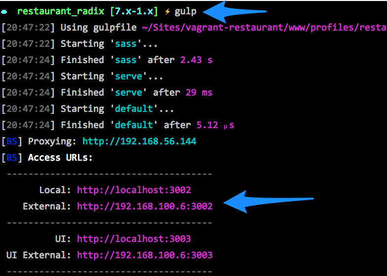

Documentation for the Radix theme for Drupal.

# Requirements

1. [npm](https://www.npmjs.com) - [Read a guide on how to install Node and npm here](https://docs.npmjs.com/getting-started/installing-node).
2. [Gulp](http://gulpjs.com) - `npm install gulp -g`
3. [Bower](http://bower.io/) - `npm install bower -g`
4. [Drush](http://drush.org) - [Read a guide on how to install Drush here](http://www.drush.org/en/master/install/).
5. [jQuery 1.7+](http://drupal.org/project/jquery_update) - Radix needs jQuery 1.7 for Drupal 7. You can install jQuery 1.7 via [jquery_update](http://drupal.org/project/jquery_update) module or [jquery_multi](http://drupal.org/project/jqmulti) module.

## Drupal 8

1. Download and enable radix: `drush dl radix; drush en radix -y; drush config-set system.theme default radix -y`.
2. Create a subtheme: `drush cc drush; drush radix "SUBTHEME NAME"`.
3. Set default theme: `drush en SUBTHEME_NAME -y; drush config-set system.theme default SUBTHEME_NAME -y`.
4. Install required modules: `cd /path/to/SUBTHEME_NAME; npm run setup;`.
5. Update proxy in `/path/to/SUBTHEME_NAME/config.json`.
6. Watch: `gulp`.


## Drupal 7

1. Download and enable Radix: `drush en radix -y; drush vset theme_default radix`.
2. Create a subtheme: `drush cc all; drush radix "Subtheme"`.
3. Set default theme: `drush en subtheme -y; drush vset theme_default subtheme`.
4. Install required modules: `cd /path/to/subtheme; npm run setup`.
5. Update browserSyncProxy in /path/to/subtheme/config.json.
6. Run gulp to watch for changes: `gulp`.

If `drush radix` is failing, run `drush cc drush` and try again.

## Custom subtheme
Customize your subtheme using options. To see a list of options, run: `drush radix --help`.

**machine_name** - By default, Radix will use the name provided to create a machine name for your theme. You can set your own machine name using this command.
`drush radix "Name of theme" --machine_name=custom_machine_name`

**description** - Replaces the default theme description.
`drush radix "Name of theme" --description="Custom description for your theme"`

**destination** - By default, your subtheme is placed inside /sites/all/themes. If you want to change its location, you can specify here.
`drush radix "Name of theme" --destination=/sites/lipsum/themes`

**bootswatch** - If you want to use a [Bootswatch](http://bootswatch.com) theme, use it as follows. See the section on Bootswatch for more details.
`drush radix "Name of theme" --bootswatch=cerulean`

## BrowserSync

[BrowserSync](https://www.browsersync.io) detects changes in your theme files and automatically reloads the browser for you.
If you have multiple devices connected to the site, BrowserSync will synchronize changes across the devices.

Here's a quick overview on how BrowserSync can be helpful:

1. Syncs mouse scroll across your devices.
2. Keep tracks of clicks and form changes.
3. Watch local source files and automatically refresh browsers on all devices when a change is made.

Radix has BrowserSync built-in. All you need to do is update the `browserSyncProxy` value in **config.json** with the url of your site. Example:
if your site is currently being served at __http://drupal.dev__, the value of `browserSyncProxy` should be `"browserSyncProxy" : "http://drupal.dev",`.

**How to test your site on multiple devices**

When you run gulp you should see local and external access urls as shown below. Use the external address to view your site on other devices.



# Responsive theming using `breakpoint`.

Radix follows the `mobile-first` convention for responsive theming. To help with that, Radix provides a `breakpoint` mixin. Here's how you can use the `breakpoint` mixin to style the body for different breakpoints:

```
body {
  background: red; // Body will have background: red for all xs devices.
  
  @include breakpoint(sm) {
    background: blue; // As from sm devices, the background will be blue.
  }
  
  @include breakpoint(md) {
    background: yelllow; // Yellow background for md devices.
  }
  
  @include breakpoint(lg) {
    background: green; // Green background for lg devices.
  }
}
```

Another example with different style for sm and md devices:

```
body {
  background: red; // Body will have background: red for all xs and sm devices.
  
  @include breakpoint(md) {
    background: blue; // Blue background for md and lg devices.
  }
}
```


# Bower

##### How to add bower components to your subtheme?

1. Go to the root of your subtheme: `cd /themes/subtheme`.
2. Run `bower install`. Example `bower install imagesloaded --save`.

This command will install the bower component and update your bower.json file.

##### Bower components in git?

Need to commit your bower components in your git repo? Edit `.gitignore` file for your subtheme and remove `bower_components`.

# Upgrade

Older versions of Radix used **Compass** gems to compile **Sass**.

To upgrade to the **Gulp** version, use the following Drush command: `drush radix-upgrade-33 theme_name`.

# FAQs

#### How to disable Drupal cache during development?

* **Step 1**: Uncomment the following lines in your `settings.php` file:

```
if (file_exists(__DIR__ . '/settings.local.php')) {
  include __DIR__ . '/settings.local.php';
}
```

* **Step 2**: Copy `example.settings.local.php` to `sites/default` and rename it to `settings.local.php`.
* **Step 3**: In `settings.local.php`, replace the following line `$settings['container_yamls'][] = DRUPAL_ROOT . '/sites/development.services.yml';` with `$settings['container_yamls'][] = DRUPAL_ROOT . '/sites/default/local.services.yml';`.
* **Step 4**: Disable the render cache by uncommenting the following line: `$settings['cache']['bins']['render'] = 'cache.backend.null';`.
* **Step 5**: Disable the Dynamic Page Cache by uncommenting the following line: `$settings['cache']['bins']['dynamic_page_cache'] = 'cache.backend.null';`.
* **Step 6**: Copy `development.services.yml` to `local.services.yml`.
* **Step 7**: Add the following in your local.services.yml`:
```
# Local development services.
#
# To activate this feature, follow the instructions at the top of the
# 'example.settings.local.php' file, which sits next to this file.
services:
  cache.backend.null:
    class: Drupal\Core\Cache\NullBackendFactory
parameters:
  twig.config:
    debug: true
    cache: false
```
* **Step 8**: Rebuild your cache: `drush cr`;

See examples that you can copy and paste:

* settings.local.php: https://gist.github.com/arshad/ce321088195b0834dfbd1dc92e585d99
* local.services.yml: https://gist.github.com/arshad/f36883a614bb849984ce7b0046f7c677


# Support

1. Create an issue on [drupal.org](https://www.drupal.org/project/issues/radix).
2. Ask us on Twitter: [@radixtheme](http://twitter.com/radixtheme).
